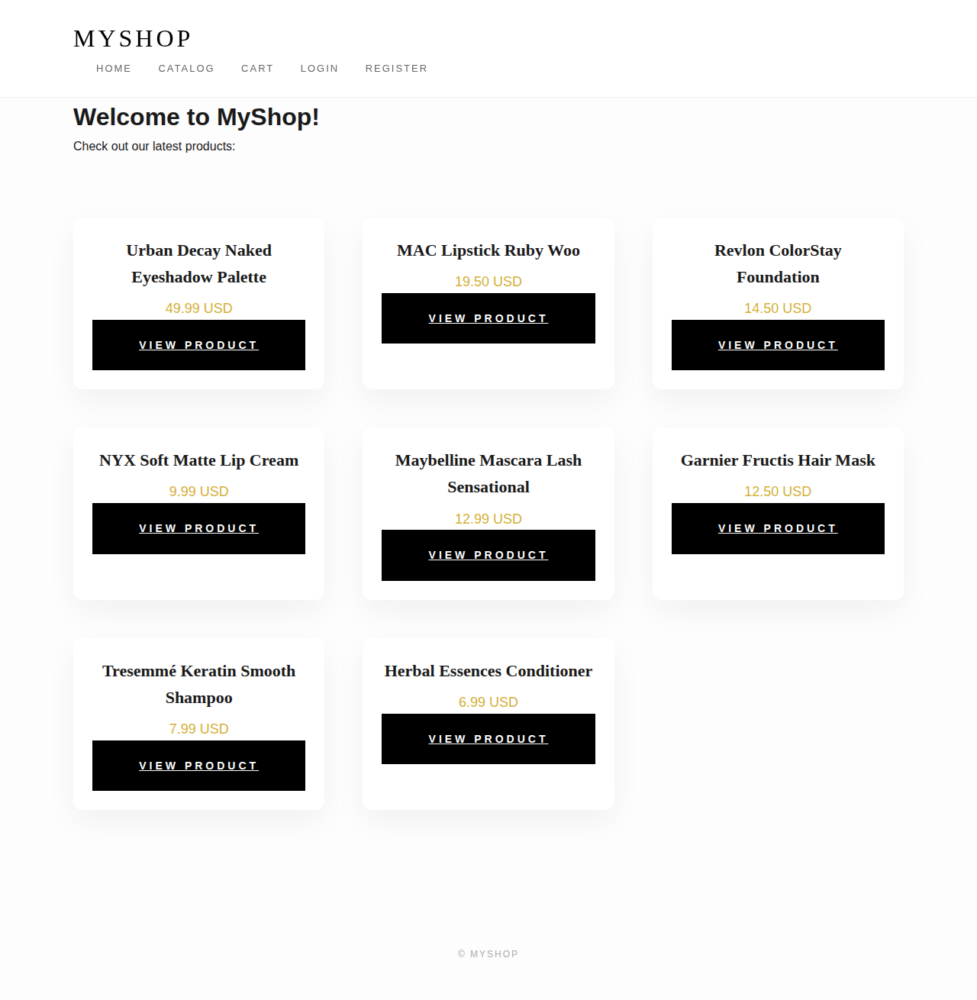
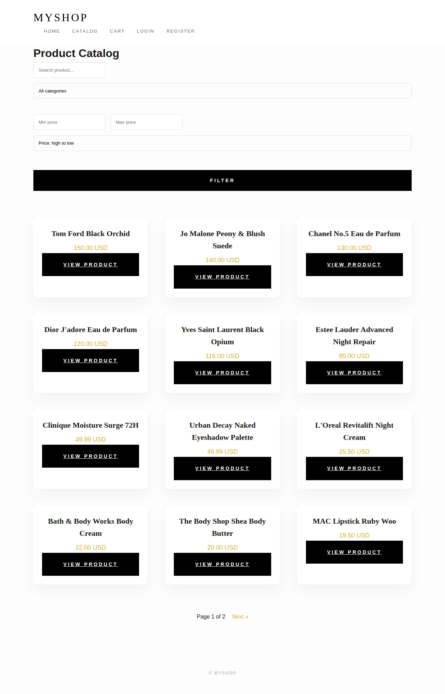
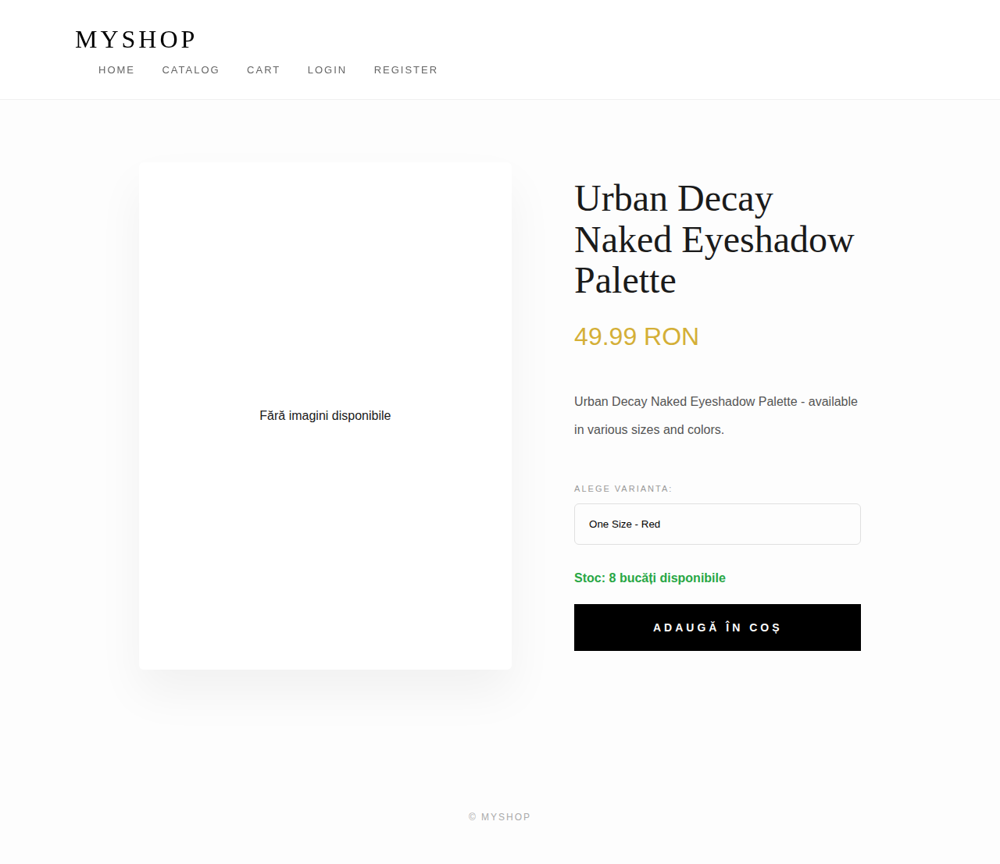
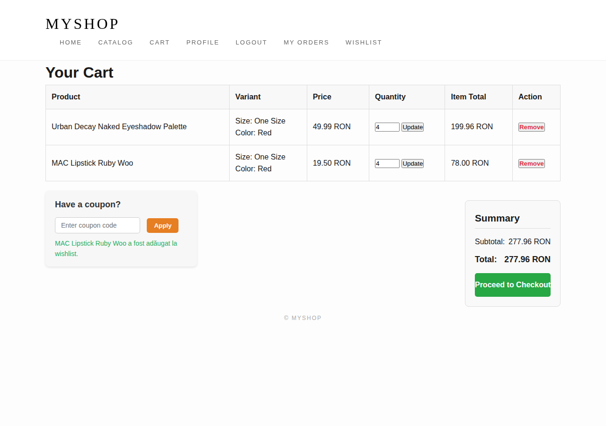
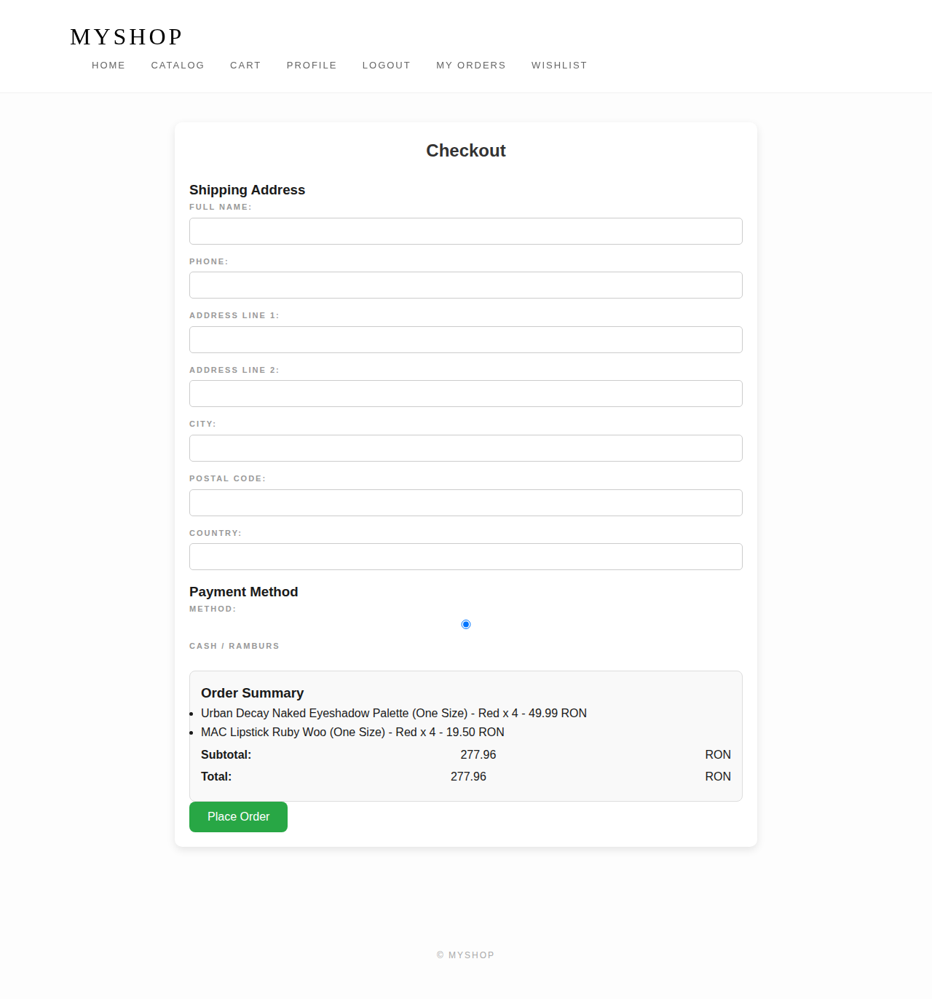
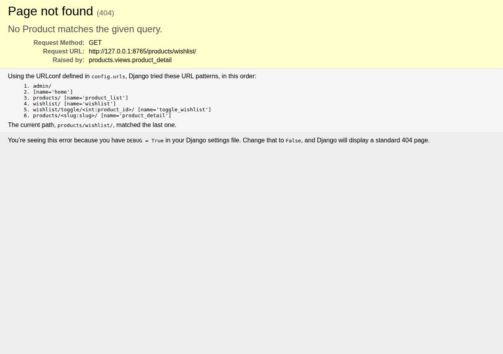
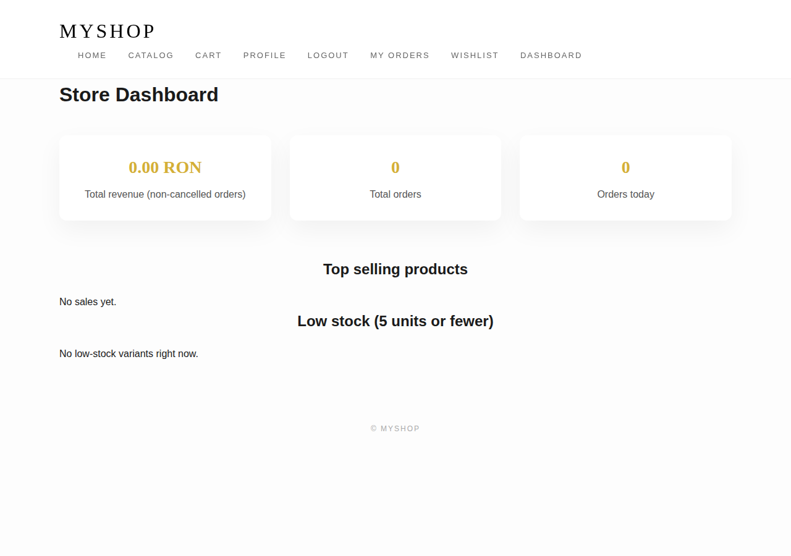

# 🛒 Django E-Commerce Pro

**Django E-Commerce** is a full-featured online marketplace platform built with Django. The project has a modular architecture to handle complex retail logic: from product variations, shopping cart, secure checkout, to coupon systems and dashboards for users and admins.

👉 The live site is available here: https://django-ecommerce-c2s6.onrender.com

---

## 📸 Screenshots

| Home | Catalog (sort/filter) |
|:---:|:---:|
|  |  |

| Product detail | Cart |
|:---:|:---:|
|  |  |

| Checkout | Wishlist |
|:---:|:---:|
|  |  |

| Staff dashboard |
|:---:|
|  |

---

## ✨ Key Features

- ✅ **Advanced Product Management** – categories, product variants, multiple image galleries, sorting and filtering (price, category, search).
- ✅ **Dynamic Shopping Cart** – real-time item management, session-based for guests, merged into the account on login.
- ✅ **Wishlist** – logged-in users can save products for later.
- ✅ **Secure Checkout** – stock-safe checkout (transactional, race-condition safe), shipping management, order history and PDF invoices with QR-ready layout.
- ✅ **Two payment methods** – Cash on delivery, or card payment via **Stripe Checkout (test mode)** when Stripe keys are configured.
- ✅ **Promotion System** – functional coupons with usage limits and discount tracking.
- ✅ **User Dashboards** – profiles and order history tracking.
- ✅ **Staff Dashboard** – revenue, order counts and low-stock alerts for store admins.
- ✅ **Admin Tools** – inventory and payment management via Django Admin.

---

## 🏗️ Project Architecture

The project is organized into modular apps, each handling a specific domain of the e-commerce ecosystem:

### 📱 Applications
- **`accounts`** – custom user model, profiles, and authentication.
- **`products`** – catalog: categories, products, variants, and wishlist.
- **`cart`** – shopping cart logic (session or database).
- **`orders`** – order creation, status, and history.
- **`payments`** – cash and Stripe (test mode) transaction processing.
- **`coupons`** – discount code validation.
- **`dashboard`** – staff-only sales/inventory analytics.

---

## 📊 Main Database Models

| Module | Core Models |
|:---|:---|
| **Identity** | `CustomUser` |
| **Catalog** | `Category`, `Product`, `Variant`, `ProductImage`, `WishlistItem` |
| **Shopping** | `CartItem` |
| **Checkout** | `Order`, `OrderItem`, `ShippingAddress` |
| **Financial** | `Payment` |
| **Marketing** | `Coupon` |

---

## 🛠️ Tech Stack

- **Backend:** Django 5.x / Python 3.11
- **Frontend:** HTML5, CSS3
- **Database:** PostgreSQL (Production) / SQLite (Dev)
- **Payments:** Stripe Checkout (test mode)
- **Image Handling:** Pillow
- **PDF invoices:** WeasyPrint
- **Deployment:** Render, via Docker
- **CI:** GitHub Actions runs `manage.py check` + the test suite on every push/PR

---

## ⚙️ Running Locally

1. **Clone & Navigate:**
```text
git clone https://github.com/SanduAndreea22/django-ecommerce.git
cd django-ecommerce/src
```

2. **Create & activate virtual environment:**
```text
python -m venv venv
# Windows:
venv\Scripts\activate
# macOS/Linux:
source venv/bin/activate
```

3. **Install dependencies:**
```text
pip install -r requirements.txt
```

4. **Initialize database, seed demo products, and create a superuser:**
```text
python manage.py migrate
python manage.py seed_products
python manage.py createsuperuser
```

5. **Run server:**
```text
python manage.py runserver
```

The server will be available at: `http://127.0.0.1:8000/`

### Optional: enabling card payments (Stripe test mode)

Card checkout only appears when both keys are set as environment variables — without them the site silently falls back to cash-only, so this step can be skipped entirely for local development:
```text
STRIPE_SECRET_KEY=sk_test_...
STRIPE_PUBLISHABLE_KEY=pk_test_...
```

### Deploying (Render / Docker)

The Dockerfile runs migrations and `seed_products` automatically on every container start, before launching gunicorn — so the live catalog stays populated without needing shell access to the server (useful on Render's free plan, which doesn't include a Shell).

---

## 👩‍💻 Author

**Andreea Sandu**  
LinkedIn: [linkedin.com/in/andreealuizasandu](https://linkedin.com/in/andreealuizasandu)  
GitHub: [@SanduAndreea22](https://github.com/SanduAndreea22)

✨ *Built with focus on scalability, clean code, and elegant UI.* ✨
